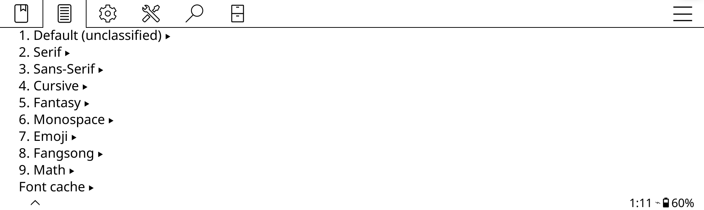
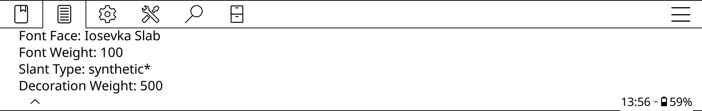
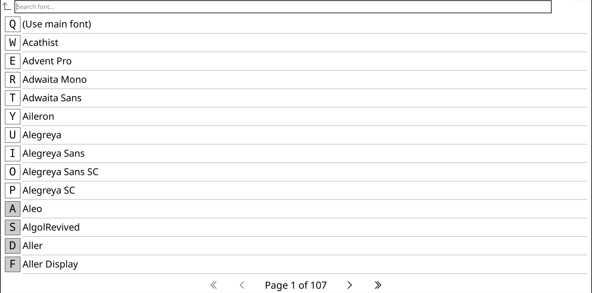
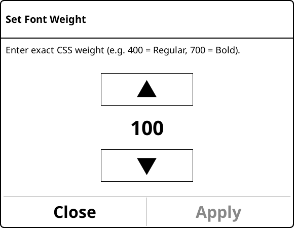
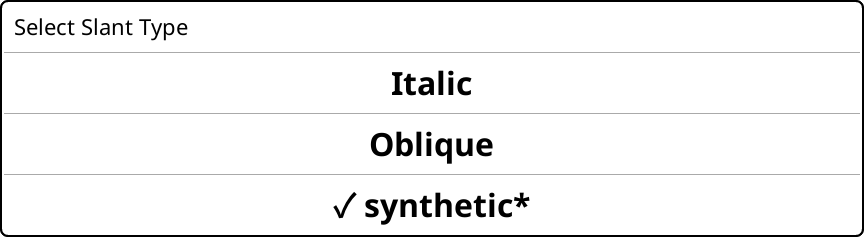
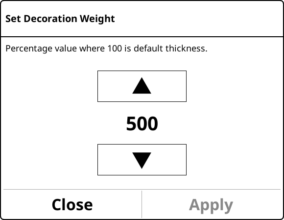
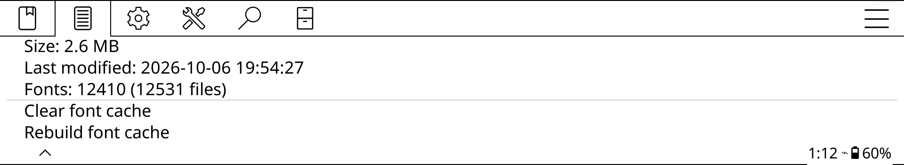

# Crengine-Extended

**For KOReader 2026.07.1** (and 2026.07.2): based on crengine
[`b32a88f`](https://github.com/koreader/crengine/commit/b32a88ffbbf505cf2ea5208c1a49002d70d3609f),
the engine version these KOReader releases use. Other versions: [Versions](#versions).

Finer typography control for [KOReader](https://github.com/koreader/koreader):
a fork of [KOReader's crengine](https://github.com/koreader/crengine) (its
EPUB/HTML/FB2 rendering engine) with a KOReader plugin, **Advanced Typography
Settings**, to control it.

Books mark their text with font categories (serif, sans-serif, monospace...).
Crengine-Extended lets you set, for each of 9 categories, independently and
for all books:

- **Font face**
- **Font weight**, from 100 to 1000
- **Slant type**: true **Italic** faces, **Oblique** faces, or **synthetic\***
  slanting, chosen the way fontconfig (`fc-query`) classifies fonts
- **Decoration weight**: thickness of underlines and strike-throughs, 50 % to 500 %

The categories: Unclassified (text with no category, a new category of its
own), Serif, Sans-serif, Cursive, Fantasy, Monospace, Emoji, Fangsong and Math.
Changes show at once.

Also:

- Font families mixing widths or spacings are split into clear entries
  ("Iosevka Slab Expanded", "CMU Typewriter Text Monospace"), only when needed.
- A font cache makes startup much faster with many fonts installed.
- Several text decorations at once (`text-decoration: underline line-through`).

## Screenshots

In a book, the plugin's menu is in the top menu's document tab, right after
KOReader's own "Typography rules":

The 9 categories, then the font cache:

Each category has its own 4 settings, each showing its current value:

Its **font face** is picked from a searchable list of all your fonts:

Its **font weight**, **slant type** (a kind the category's font doesn't have
is greyed out) and **decoration weight**:

  
  
  

Note: the font weight is now set per category, but bold text behaves as in
KOReader: it stays 300 heavier than the weight set (bold is weight 700 in a
book, normal text 400), up to the maximum weight of 999.

And the font cache, with its size, date and number of fonts:

## Versions

| Tag | For KOReader |
|---|---|
| [`koreader-2026.07.1-extended`](https://github.com/Absolute-Confusion/Crengine-Extended/tree/koreader-2026.07.1-extended) | 2026.07.1, 2026.07.2 |

Each KOReader release needs its own version: KOReader doesn't include these
changes, so they are moved onto each release's crengine.

## Install

Crengine-Extended has to be built into KOReader from source (the plugin needs
the extended engine). See **[extended/README.md](../extended/README.md)**: get
the extended crengine into a KOReader source tree, build, install the plugin,
and test.

## Documentation

- [extended/README.md](../extended/README.md): install, test, and port to newer
  KOReader versions
- [extended/CHANGELOG.md](../extended/CHANGELOG.md): every change compared with
  upstream crengine
- [extended/tests/README.md](../extended/tests/README.md): the automated tests

## Why a fork

These features were offered to KOReader, whose developers decided not to
include them. This fork keeps them available, ported to each KOReader release.
The crengine changes are a single commit on top of upstream, so they stay easy
to review, or to take in part.

## License

crengine and the changes to it: GNU GPL v2. The plugin and tests: GNU AGPL v3,
as KOReader. Test fonts: SIL OFL 1.1. Details:
[extended/LICENSE.md](../extended/LICENSE.md).
