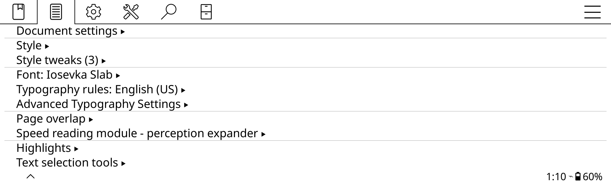

# Crengine-Extended: install, test and port

Per-category typography for KOReader: changes to **crengine** (KOReader's
EPUB/HTML/FB2 engine) and the **Advanced Typography Settings** plugin that
gives them a menu. The plugin needs the extended crengine: it doesn't work on
an unmodified KOReader.

## What it adds

For each of 9 font categories (Unclassified, Serif, Sans-serif, Cursive,
Fantasy, Monospace, Emoji, Fangsong, Math), set independently and globally
(not per book):

- **Font face**
- **Font weight** (100 to 1000)
- **Slant type**: Italic, Oblique or synthetic*. Faces are classified like
  fontconfig (`fc-query`) does, and slanted text only uses faces of the
  chosen kind. Kinds a category's font doesn't have are greyed out.
- **Decoration weight**: thickness of underlines, overlines and
  line-throughs (50 % to 500 %)

Also:

- **Unclassified** category: text with no generic font family (including a
  `font-family` naming only specific fonts) is controlled by its own settings.
- **Font families grouped by width and spacing**: a family mixing widths or
  spacings is split into entries such as "Iosevka Slab Expanded" or
  "CMU Typewriter Text Monospace". A word is only added on such a mix. Former
  names (eg. "DejaVu Sans Condensed") still work in books.
- **Font cache** (`cache/fontlist/crengine_fonts.dat`): fonts are known at
  startup without opening their files (only used fonts get opened), so startup
  is much faster with many fonts. It is only rewritten when font files are
  added, changed or removed. The plugin shows its size and date, and can clear
  or rebuild it.
- **No document cache** (plugin option, off by default): no cache file of
  opened books is kept, so opening and closing a book writes none. Books are
  then laid out again at each opening (slower for large books).

Full list of changes: [CHANGELOG.md](CHANGELOG.md).

## How this repository is organized

It's a fork of [koreader/crengine](https://github.com/koreader/crengine).

- The **`extended`** branch is the crengine version used by a KOReader
  release, plus two commits:
  1. **"Crengine-Extended for KOReader \<version\>"**: the crengine changes
     (only crengine's own files).
  2. **"Crengine-Extended extras for KOReader \<version\>"**: this
     `extended/` folder (plugin, tests, patch files, documentation) and the
     front page.
- Each KOReader version gets a **tag**: `koreader-2026.07.1-extended`, and so
  on. The `extended` branch always has the latest one; older ones stay
  available under their tags.

| Tag | KOReader | crengine base |
|---|---|---|
| `koreader-2026.07.1-extended` | 2026.07.1 (and 2026.07.2, same crengine) | `b32a88ffbbf505cf2ea5208c1a49002d70d3609f` (2026-07-02) |

## This folder

| Path | What |
|---|---|
| `patch/crengine-extended.patch` | The crengine changes as a patch (git format, records its base version: use this one) |
| `patch/crengine-extended.diff` | The same changes in plain diff format, for a crengine without git |
| `apply.sh` | Applies the patch to a KOReader source tree (section 1) |
| `make_patch.sh` | Regenerates both patch files from the branch (section 5) |
| `plugin/advancedtypography.koplugin/` | The KOReader plugin |
| `tests/` | Automated tests (section 4 and `tests/README.md`) |
| `screenshots/` | Screenshots of the plugin's menus |
| `android/` | Builds the Android app, KOReader Extended (see "Release packages") |
| `porting-prompt.txt` | Instructions to give an AI agent porting this to a newer KOReader |
| `CHANGELOG.md` | All changes compared with upstream crengine |
| `DESIGN.md` | How and why it works: principles, the life of a setting, decisions, pitfalls, invariants (read it before changing or porting) |
| `LICENSE.md` | Licenses of each part |

## 1. Get the extended crengine into KOReader

You need KOReader's source tree, at the version this is for
(`git clone --recursive https://github.com/koreader/koreader.git`, then
`git checkout v2026.07.1` and `git submodule update --init --recursive`).
KOReader's crengine is in `base/thirdparty/kpvcrlib/crengine/`. Pick one of
the 3 ways below.

### A. Check out this repository's tag (git)

From KOReader's crengine folder:

```sh
cd base/thirdparty/kpvcrlib/crengine
git remote add extended https://github.com/Absolute-Confusion/Crengine-Extended.git
git fetch extended --tags
git checkout koreader-2026.07.1-extended
```

This also brings the `extended/` folder into that crengine folder: KOReader's
build ignores it (it builds crengine from a fixed list of source files), and
you can install the plugin from it.

### B. Apply the patch (`apply.sh`)

```sh
extended/apply.sh /path/to/koreader
```

`apply.sh` finds crengine in `base/thirdparty/kpvcrlib/crengine/` and:

- refuses to run if crengine has uncommitted changes (so nothing gets mixed up),
- says so and does nothing if the patch is already applied,
- applies it exactly if crengine is at the patch's base version (which it
  reads from the patch),
- otherwise applies it with a **three-way merge** (see section 5),
- falls back to `patch` if crengine isn't a git checkout.

Add `--check` to only see whether it would apply, without changing anything.
To point it at a crengine directly: `extended/apply.sh --crengine /path/to/crengine`.

Manual equivalent with git, from the crengine directory:

```sh
git apply --3way /path/to/extended/patch/crengine-extended.patch
```

### C. With the `patch` command only

Both patch files also work with the standard `patch` command (GNU patch, as on
any Linux), no git needed. From the crengine directory:

```sh
patch -p1 --dry-run < /path/to/extended/patch/crengine-extended.diff   # check first, changes nothing
patch -p1 < /path/to/extended/patch/crengine-extended.diff             # apply
patch -R -p1 < /path/to/extended/patch/crengine-extended.diff          # undo
```

On the base version it applies exactly (no "fuzz" or "offset" messages). On a
newer crengine, check its output as described below. On crengine `517b8f0`
(82 commits newer than the base), `patch` fails 10 parts and applies 3 with
fuzz. The git three-way merge (`apply.sh`) never places code by guessing, and
marks what it can't merge right in the files (11 conflicts there): prefer it
when crengine is a git checkout.

### Reading `patch`'s output: did it really apply?

Not seeing the word "FAILED" isn't enough: some problems are reported
differently. Always do a dry run first, and check its **exit code**:

```sh
patch -p1 --dry-run < /path/to/extended/patch/crengine-extended.diff; echo "exit: $?"
```

| Exit code | Meaning |
|---|---|
| `0` | Every part applies (possibly with "fuzz" or "offset": see below) |
| `1` | Some parts don't apply |
| `2` | Serious trouble (a file not found, a damaged patch...) |

Messages to look for:

| Message | Meaning | What to do |
|---|---|---|
| `Hunk #3 FAILED at 2609.` and `1 out of 6 hunks FAILED -- saving rejects to file lvrend.cpp.rej` | That part didn't apply; when applying for real, it is saved in the `.rej` file | Apply it by hand, from the `.rej` file |
| `Hunk #1 succeeded at 2596 with fuzz 2` | Applied, but `patch` ignored some of the surrounding lines to place it: **it may be in the wrong place** | Check that part of the file |
| `Hunk #1 succeeded at 2596 (offset 201 lines)` | Applied, only at another line number than in the patch | Usually fine |
| `Reversed (or previously applied) patch detected! Assume -R? [n]` | The patch looks already applied (or it's another patch) | Answer `n` (or press Enter), unless you mean to undo it |
| `can't find file to patch at input line ...` followed by `File to patch:` | Run from the wrong directory, or wrong `-p` level | Press Ctrl+C; run it from the crengine directory with `-p1` |

Apply for real only when the dry run's exit code is `0` and its output has no
"fuzz" (or you've checked each fuzzy part). On the base version, that's always
the case.

Even then, a clean apply on a newer crengine doesn't prove the result still
works (upstream may have changed what the patch relies on): build it, and test
it as described in section 4.

## 2. Build KOReader

From the KOReader source tree:

```sh
./kodev build                  # desktop emulator; then ./kodev run
./kodev release kobo           # a device package (other targets: ./kodev release --help)
```

## 3. Install the plugin

Copy the whole `plugin/advancedtypography.koplugin` folder into KOReader's
`plugins` folder:

| Platform | Folder |
|---|---|
| Kobo | `.adds/koreader/plugins/` |
| Kindle | `koreader/plugins/` |
| PocketBook | `applications/koreader/plugins/` |
| Android | `/sdcard/koreader/plugins/` |
| Desktop Linux | `~/.config/koreader/plugins/` |
| KOReader source tree / emulator | `plugins/` |

If an older copy of this plugin named `typography.koplugin` is there, delete
it: that name conflicts with KOReader's own Typography module.

Restart KOReader. The first start builds the font cache (it takes a bit
longer once). In a book, open the top menu, document (typeset) tab: **Advanced
Typography Settings** is right after KOReader's own **Typography rules**.



Note: the category font faces, weights, slant types and decoration weights are
global settings. The plugin makes KOReader ignore and drop the per-book font
choices it used to save.

## 4. Test it

With KOReader built (`./kodev build`) and the plugin installed in its source
tree's `plugins/` folder:

```sh
extended/tests/run_tests.sh /path/to/koreader
```

It runs 14 test suites in about 10 seconds and ends with
`14 passed, 0 failed, 0 skipped`. They check the independence of the 9
categories, slant type selection, live changes, deferred saving, family
grouping, the font cache and the menu. Your own KOReader settings, books and
caches are never used or changed. Details: `tests/README.md`.

## 5. Porting to a newer KOReader

KOReader doesn't include these changes, so each new KOReader release needs
them moved onto its crengine. In short: move the two commits onto the new
crengine version, resolve conflicts, test, regenerate the patch, tag.
(`porting-prompt.txt` has the same steps as instructions for an AI agent.)
Read [DESIGN.md](DESIGN.md) first: when upstream reworked code a change relies
on, re-apply its principle, not just the old lines (its section 12 lists where
this project hooks into upstream).

1. **Find the new base**: the crengine commit the new KOReader release uses.
   In a KOReader source tree at that release (with its submodules):

   ```sh
   git -C base/thirdparty/kpvcrlib/crengine rev-parse HEAD
   ```

2. **Move the commits onto it**, from this repository:

   ```sh
   git fetch upstream
   git switch extended
   git rebase --onto <new base> <old base>
   ```

   (`<old base>` is in the table above.) Conflicts are expected in the first
   commit only (crengine's files): git stops at each one, marked in the file:

   ```
   <<<<<<< (upstream's newer code)
   ...
   =======
   ...      (this project's code)
   >>>>>>> (Crengine-Extended for KOReader ...)
   ```

   Edit each to keep **both** upstream's change and this project's, remove the
   markers, `git add` the file, then `git rebase --continue`.

3. **Update the version** in both commits' messages ("for KOReader
   \<version\>", and the first one's "Base:" line): `git rebase -i <new base>`,
   mark both commits `reword`.

4. **Build and test**: put this crengine into the new KOReader (section 1, A
   or B), build it, install `plugin/` in its source tree, run the tests
   (section 4). If a test fails because KOReader changed how things are done,
   update how the test does it, never what it checks.

5. **Update `extended/`**, in the second commit (`git commit --amend` while it
   is the last commit):
   - `./make_patch.sh` (regenerates both patch files, with the new base),
   - the plugin's version in `plugin/advancedtypography.koplugin/_meta.lua`,
   - the tag table above, and section 1's version numbers,
   - the version line and table on the front page (`.github/README.md`),
   - a new section in `CHANGELOG.md`,
   - the "What to expect" table below, if you checked newer versions.

6. **Tag and publish**:

   ```sh
   git tag koreader-<version>-extended
   git push --force-with-lease origin extended
   git push origin koreader-<version>-extended
   ```

   (The branch is rewritten by the rebase, hence `--force-with-lease`; older
   versions stay available under their tags.) Then create a GitHub Release
   from the tag, with both patch files attached.

### What to expect (koreader-2026.07.1-extended, checked on 2026-10-06)

How this version's patch applies to newer crengine versions:

| crengine version | Plain patch | Three-way merge (or rebase) |
|---|---|---|
| `b32a88f` (base, 2026-07-02) | applies | applies, identical to the original |
| `536b341` (2026-08-08, 44 commits newer) | 10 of 87 parts fail | 11 conflicts in 2 files |
| `54711f9` (2026-08-31) | 10 fail | same 11 conflicts |
| `517b8f0` (2026-09-23, 82 commits newer) | 10 fail | same 11 conflicts |

Those conflicts are all in the font code, which upstream reworked after the
base:

- `lvfntman.cpp`, 7 one-line conflicts: upstream added a `docFragmentIdx`
  parameter to the font selection functions (`matchFamily()`, `select()` and
  their calls) where this project adds `slant_type`. Keep both parameters.
- `lvfntman.cpp`, 3 conflicts: upstream replaced the font alias storage
  (`_alias_from`/`_alias_to`/`_alias_doc`) with `LVFontAlias` entries, where
  this project adds its width/spacing grouping data (`_installed_masks`,
  `_installed_aliases`, `_installed_faces`, `registerInstalledFace()`). Keep
  upstream's new alias code and add the grouping code next to it.
- `lvrend.cpp`, 1 conflict: upstream added a comment and a parameter to
  `getFont()` right where this project adds its functions before it. Keep both.

### After porting, check

- It builds without errors or new warnings.
- All test suites pass (section 4).
- The menu entry is there, after Typography rules, and the Font cache entry
  shows a font count.
- Changing a category's weight, slant type and decoration weight changes only
  that category's text, at once, and survives closing and reopening the book.

## Release packages (AppImage, APK)

The GitHub Releases have ready-made KOReader builds with Crengine-Extended.
They are built from a KOReader source tree with the extended crengine and the
plugin (sections 1 and 3), in KOReader's own build containers, with podman.

**Linux AppImage**, in KOReader's AppImage container (Ubuntu 22.04, so it runs
on most current Linux systems), from the KOReader source tree:

```sh
podman run --rm --userns=keep-id:uid=1001,gid=1001 \
    -v "$PWD:/home/ko/koreader:z" -w /home/ko/koreader \
    docker.io/koreader/koappimage:2.0.0-22.04 ./kodev release linux appimage
```

**Android APKs**: `android/build_apk.sh /path/to/koreader arm64 arm x86_64 x86`
(any of those types; arm64 by default), in KOReader's Android container. It
builds **KOReader Extended**, a separate app that installs next to the official
KOReader, without changing any KOReader file (`android/init.gradle`):

- its own app ID, `io.github.absoluteconfusion.koreader`, and name,
- KOReader's in-app updater off (it would offer official KOReader updates,
  which don't contain Crengine-Extended),
- the plugin's version as its version name.

Both apps use the same `koreader` folder on the device's storage. The APKs come
out unsigned: sign each with `apksigner` and your key, the same key for every
version (Android only installs an update signed with the key of the installed
app).

## Developer notes

- Keep the two commits separate: crengine's files in the first one only, the
  `extended/` folder in the second one only. Upstream can then take the first
  one as it is.
- The font cache's format version is `FONTS_CACHE_VERSION` in
  `crengine/src/lvfntman.cpp`. Increase it whenever what is cached about a font,
  or how it is computed, changes: existing caches are then rebuilt once.
- The plugin's `slantinfo.lua` reads crengine's font classification from that
  font cache (to grey out unavailable slant types), and rebuilds crengine's
  width/spacing family names from it. If the cache's format changes, update its
  reader; if the family naming changes, update it too.
- The plugin must not call C library functions directly (FFI): KOReader's
  Android build only provides the functions KOReader itself uses, so a call
  that works on Linux can fail on Android. Test suite 13 checks this.

## Undo

- After A (tag checkout): `git -C /path/to/koreader/base submodule update thirdparty/kpvcrlib/crengine`
  puts back the crengine version KOReader uses.
- After B: from the crengine directory, `git checkout -- crengine`.
- After C: `patch -R -p1 < crengine-extended.diff`.

Then rebuild, and remove the plugin folder.
